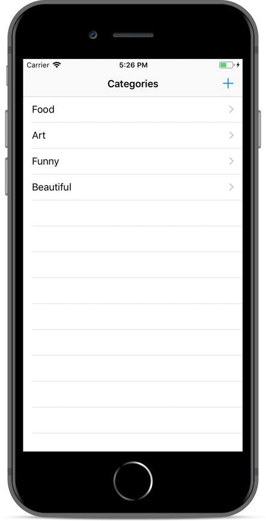
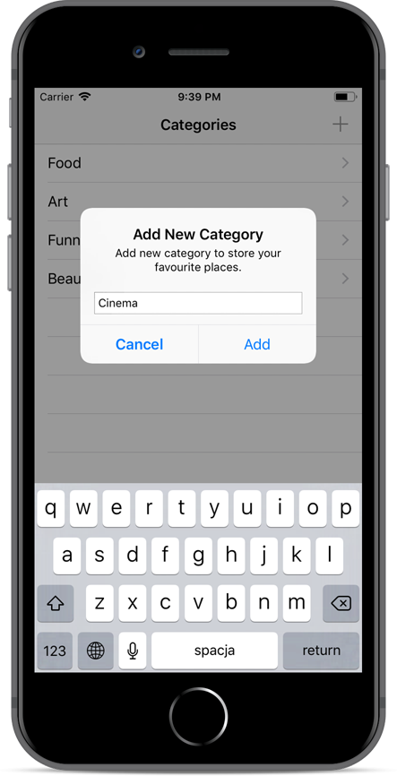
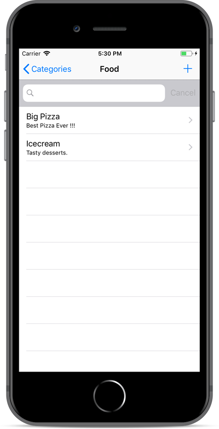
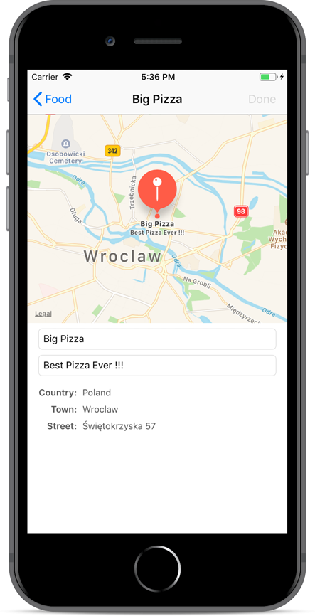

Places
---
In Places app user can create own categories and add there favourite places. Chosen locations as well as additional info are shown on the map. App uses Realm to persist data.

* Realm
* Location Manager
* Map
* Cocoapods
* Table View
* Alert

